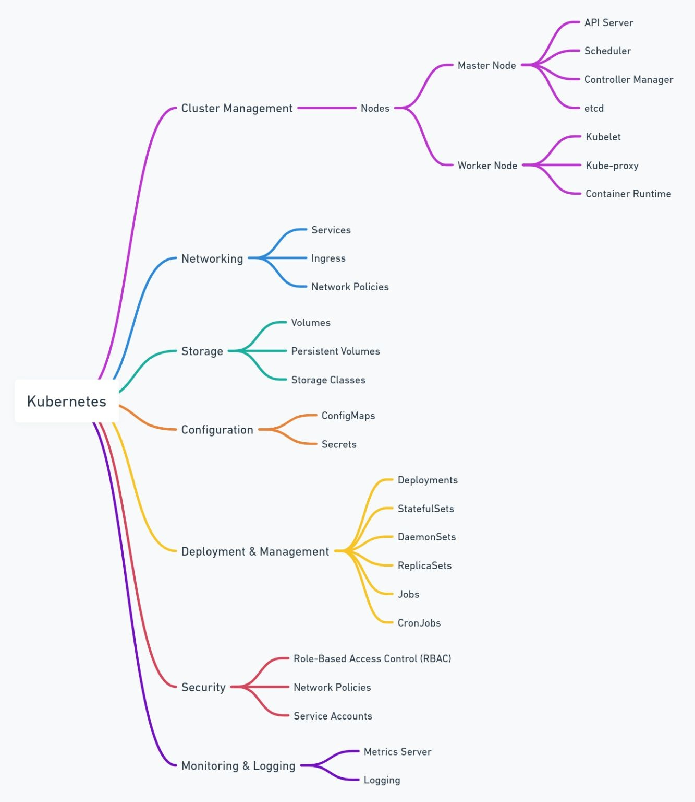

## Kubernetes-101

K8s Installation made simple to help the bigginers who try to install a fresh cluster. 
This document briefs how Kubernetes and docker installation on CentOS 7.x or RedHat 7.x. For kubernetes deployment, it used kubeadm bootsraping. Kubeadm works on multiple platforms and helps easy setup. 

### K8s Map

  

